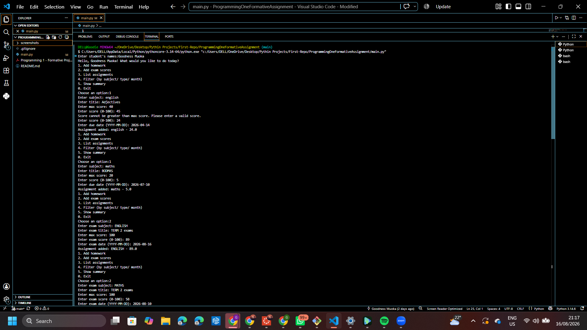
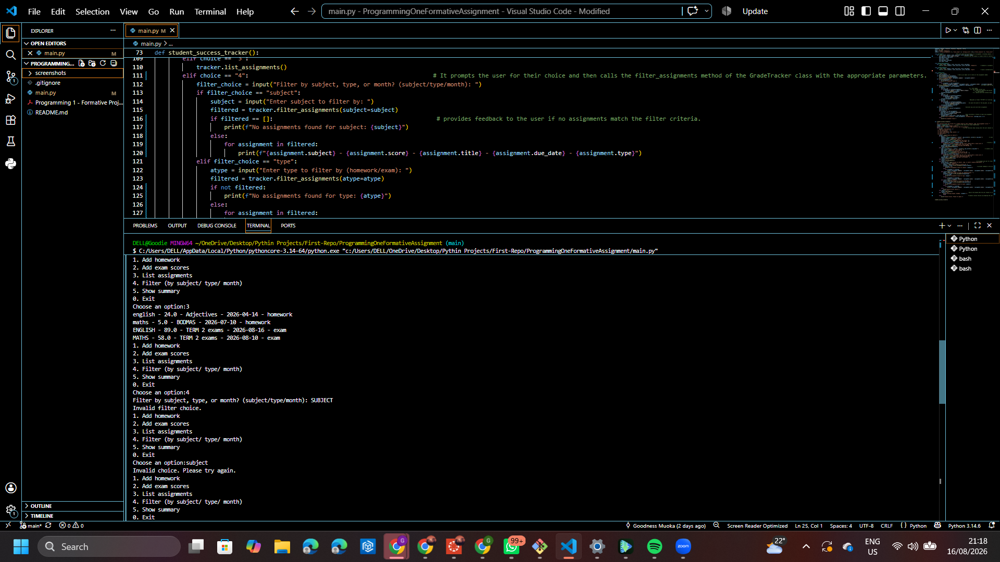
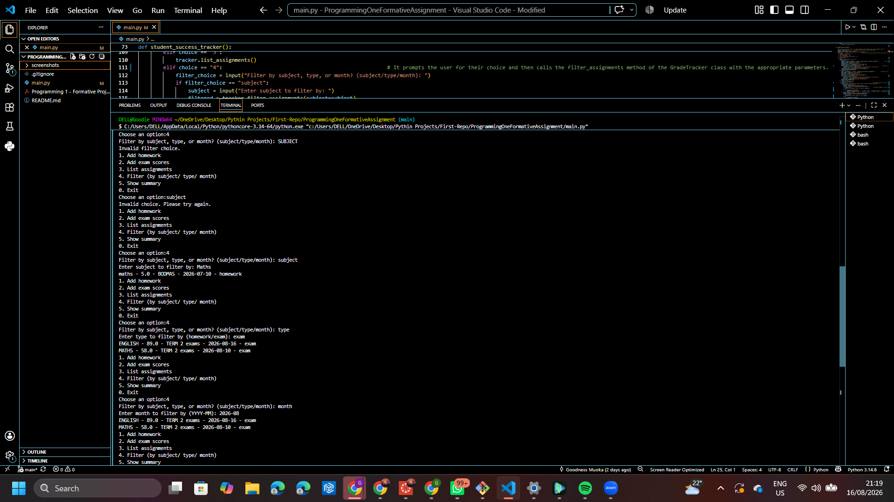
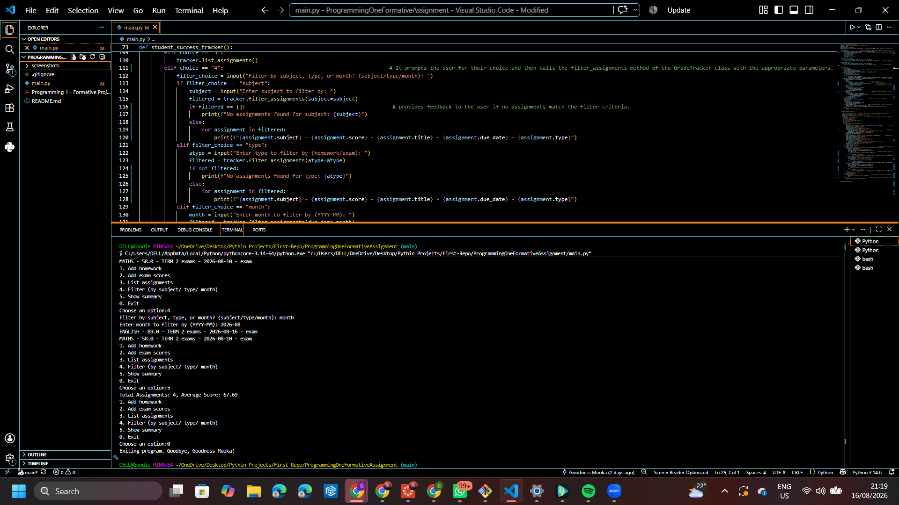

# Student Grade/Assignment Tracker
 
A command-line program that lets a student record homework and exam results, list and filter what they've entered, and see a summary of their overall performance — all within a single terminal session.
 
## Features
 
- Add homework assignments (subject, title, score, max score, due date)
- Add exam results (same fields as homework)
- List all assignments entered so far
- Filter assignments by subject, type (homework/exam), or month
- Show a summary: total assignments and overall average score
- Input validation: a score can never be entered higher than its max score
- Case-insensitive subject filtering (e.g. "Math", "math", and "MATH" are treated the same)
- Graceful handling of invalid menu choices and empty results

## How to Run
 
1. Clone this repository:
```
   git clone https://github.com/gmuoka-bot/ProgrammingOneFormativeAssignment.git
```
2. Open the folder in VS Code (or your preferred editor).
3. Run the program from the terminal:
```
   python main.py
```
4. Enter your name when prompted, then follow the on-screen menu.

## Menu Structure
 
```
1. Add homework
2. Add exam scores
3. List assignments
4. Filter (by subject/ type/ month)
5. Show summary
0. Exit
```
- **1 / 2** — asks for subject, title, max score, score, and due date. If the score entered is higher than the max score, the program keeps asking until a valid score is given.
- **3** — prints every assignment added so far, or a message if nothing has been added yet.
- **4** — asks whether to filter by subject, type, or month, then asks for the value to filter by. If nothing matches, a clear message is shown instead of blank output.
- **5** — shows the total number of assignments and the overall average score, calculated as total score earned ÷ total points possible.
- **0** — exits the program.

## Sample Interaction
 
```
Enter student's names: Goodness Muoka
Hello, Goodness Muoka! What would you like to do today?
1. Add homework
2. Add exam scores
3. List assignments
4. Filter (by subject/ type/ month)
5. Show summary
0. Exit
Choose an option:1
Enter subject: Maths
Enter title: Addition
Enter max score: 50
Enter score (0-100): 52
Score cannot be greater than max score. Please enter a valid score.
Enter score (0-100): 25
Enter due date (YYYY-MM-DD): 2026-10
Assignment added: maths - 25.0
 
Choose an option:2
Enter exam subject: English
Enter exam title: Term 1 examination
Enter max score: 100
Enter exam score (0-100): 100
Enter exam date (YYYY-MM-DD): 2026-06-10
Assignment added: english - 100.0
 
Choose an option:3
maths - 25.0 - Addition - 2026-10 - homework
english - 100.0 - Term 1 examination - 2026-06-10 - exam
 
Choose an option:4
Filter by subject, type, or month? (subject/type/month): subject
Enter subject to filter by: english
english - 100.0 - Term 1 examination - 2026-06-10 - exam
 
Choose an option:5
Total Assignments: 2, Average Score: 83.33
 
Choose an option:0
Exiting program. Goodbye, Goodness Muoka!
```
 
## Screenshots
 
**Adding assignments**

 
**Listing assignments**

 
**Filtering assignments**

 
**Showing summary**

 
## Project Structure
 
```
ProgrammingOneFormativeAssignment/
- main.py           # all source code (classes + menu logic)
- README.md          # this file
- screenshots/        # screenshots showing add, list, filter, summary
- reflection.pdf       # short reflection on the project
```
 
## Built With
 
- Python 3
- Visual Studio Code

 